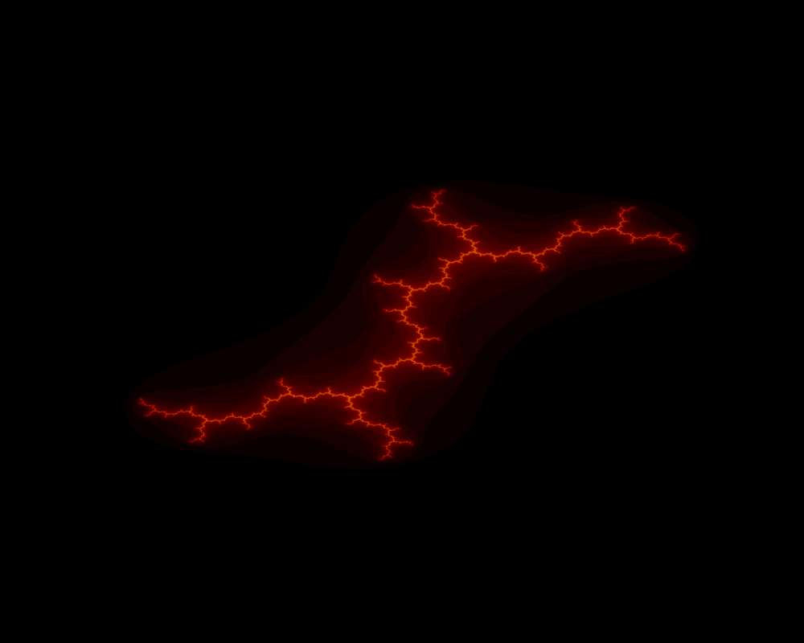

# Fractals
Here I put some of my projects involving fractals


## Short description
For now it's a simple class that will generate a static figure of Julia Set or animation of Julia sets. The function for which the point stays inside the circle () is .

## How to use
To generate a default, static figure just import JuliaClass to your program and write:

```python3
from JuliaClass import Fractal

fractal = Fractal(width=1920, height=1080, iterations=200)

fig = fractal.DisplayFigure(cx=0, cy=1)
```

and it should generate an image:



To generate an animation:

```python3
from JuliaClass import Fractal

fractal = Fractal(frames=200, iterations=200)

anim = fractal.DisplayAnimation()
```


Now, the one above with 200 iterations parameter set, it most likely won't run in real time. I saved it after the animation was complete.

To do that, execute:

```python3
anim.save('sometitle.gif', writer='ffmpeg')
```

## To do:
- Make it faster - I have a code that uses `numba` to speed up animations with `@njit` decorator, integrate it into existing class.
- Make it run on GPU for high performance, also using `numba`.
- Mandelbrot set generator (with step by step animation).
- Make code more elegant.
